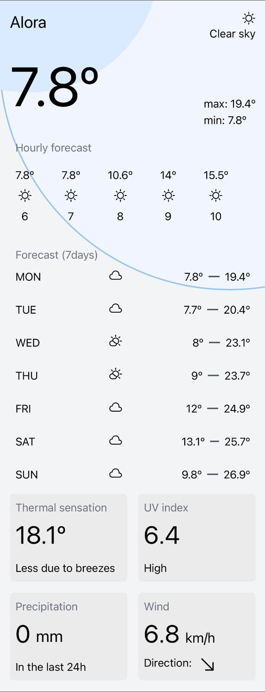
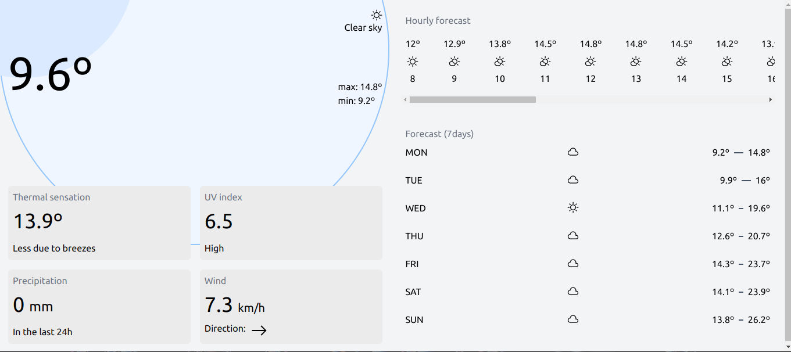
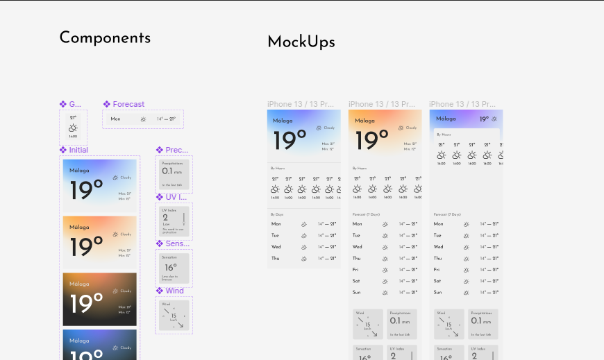

# Over-Engineered Weather App ⛅

This project is an over-engineered weather app, the purpose of this
repo is to demonstrate the ability with multiple technologies.

## Index 📍
1. [Technologies used in this repo](#technologies-used-in-this-repo-)
2. [Decistion-making](#decision-making-) 
3. [Front-end technologies](#front-end-technologies-)
4. [Design](#design-)
5. [Back-end technologies](#back-end-technologies-)
6. [Deployment](#deployment-)
7. [Code quality and standarization](#code-quality-and-standardization-)
8. [Local development](#local-development-)
   1. [Prerequisites](#prerequisites)
   2. [Next steps](#nex-steps)
   3. [Start front-end service](#start-front-end-service)
   4. [Start back-end service](#start-backend-end-service)
9. [Considerations](#considerations)

## Technologies used in this repo 🛠️
Javascript, Typescript, Vite, React, Tailwind, Jest, Node, Express, Figma, AWS EC2, Github Actions,
Eslint, Prettier, Husky, Docker*, Docker Compose*.

## Decision-making 🧭

The first step when developing any kind of project should be to 
analise the needs of the project and to decide which technologies
are better suited for those needs.

In this case, the goal of the project is to show-case my
abilities with different technologies and knowledge on the field.

Every one of the next sections of this file contains a brief
description of the technologies used and why they have been chosen.

## Front-end technologies 🖥️

The project's front-end is based on React, as it is the most
popular Javascript framework.  Next.j could be another option,
but since this project won't have take advantage of
SSR (Server Side Rendering), it won't be much useful.

The project has been created using Vite, as it allows us
to have more controll over the project dependencies that CRA,
and it is simpler than the Webpack approach.

To test the web, React Testing Library and Jest has been used,
as the combination of both allows us to have enough testability.

## Design ⭐

As the app is going to be mainly used in mobiles phones,
it has been decided to take a 'mobile first' approach. Although
it is responsive and can be used from desktop too.

To speed up the design process, a css library like Tailwind
has been implemented.

Figma has been the tool used to develop the mockups and the
final designs. The design use a 60:30:10 ratio of colors.

### Final design



### Figma designs


## Back-end technologies ⚙️

The backend could be omitted from the project, as the necessary calls 
to the APIs, could be made directly from the front-end, but as the
goal of the project is to show-case the ability with the tool, it has
been decided to have a back-end service.

The backend uses Express, a Node.js framework, because it is light and
very easy to work with.

The project do not use any database system, as it is not required
to store any user information.

## Deployment 🚅
The website can
be accessed through the domain [overengineeredweatherapp.cloud](https://overengineeredweatherapp.cloud/).
Its connection is encrypted with SSL signed by Letsencript.

To make the project publicly available, it is deployed at an EC2 instance
in AWS, which also have a NGinx server, to manage its call. 

To speed up the deployment process a CI/CD pipeline has been
established using GitHub CI/CD and pm2.

This project initially used Docker for the deployment, but it was
later decided to stop using it, as it was more inconvenient. The
Docker compose file and each of the Dockerfiles used are still present
in the project, as the goal of it is to showcase.

## Code quality and standardization 🪝

To ensure the quality of the code and its standardization,
tools Husky is used. It allows us to run Prettier, ESlint, and test
before committing to the repo.

## Local development 👨‍💻

This guide assume you are using a Linux base distribution or MacOS.
If you are a Windows user, please follow these steps using the instructions 
using the documentation of each technology for windows.

### Prerequisites
In order to test the project locally you would need first some dependencies first some dependencies.

1. Install `npm`
```bash
sudo apt install npm
```

The project uses Node v18. In order to obtain it, you can download npm and then nvm

2. Install [nvm](https://github.com/nvm-sh/nvm#install--update-script)

3. Use Node v18
```bash
nvm install --lts
```
```bash
nvm use --lts
```

* Install typescript globally
```bash
npm i -g typescript
```

### Nex steps

1. Clone the repository in your desire destination.

2. Enter the repo.
```bash
cd /your/desired/path
```

### Start front-end service
Open another terminal to start the front-end service.
In the new terminal cd into the `frontend/` folder which is inside the project's root folder.

1.  Enter the frontend's folder.
```bash
cd frontend/
```

2. Create a `.env` file
```bash
touch .env
```

3. Write the following variables into the file
```dotenv
VITE_PORT=8080
VITE_API_PORT=3001
VITE_AWS_IP=localhost
```

4. Install the dependencies
```bash
npm install
```

5. Start local development
```bash
npm run dev
```

### Start backend-end service
Open another terminal to start the backend-end service.
In the new terminal cd into the `backend/` folder which is inside the project's root folder.

In order to create the backend service, it is required to create a self-signed SSL cert, for local development.

1. Go to the folder where you want to save the ssl certificate.
```bash
cd /your/path/to/the/ssl/certificate/
```

3. Create the SSL certificate
```bash
openssl req -x509 -out localhost.crt -keyout localhost.key   -newkey rsa:2048 -nodes -sha256   -subj '/CN=localhost' -extensions EXT -config <(printf "[dn]\nCN=localhost\n[req]\ndistinguished_name = dn\n[EXT]\nsubjectAltName=DNS:localhost\nkeyUsage=digitalSignature\nextendedKeyUsage=serverAuth")
```

4.  Now with the certificate created, go back to the project folder
```bash
cd /your/desired/path
```

5. Enter the backend's folder
```bash
cd backend/
```

6. Create a `.env` file
```bash
touch .env
```

7. Write the following variables into the file
```dotenv
PORT=3001
DOMAIN=
CERT_PATH=/your/path/to/the/ssl/certificate/
CERT=localhost.crt
KEY=localhost.key
```
8. Install the dependencies
```bash
npm install
```

9. Compile the project
```bash
npm run build
```

10. Run the development server
```bash
npm run start
```

## Considerations

* Sometimes the domain resolution takes a bit of time, in which case it is
easier to visit the page using the IP address.

* From time to time the EC2 instance gets overwhelmed for not apparent reason,
which makes the CI/CD to freeze.